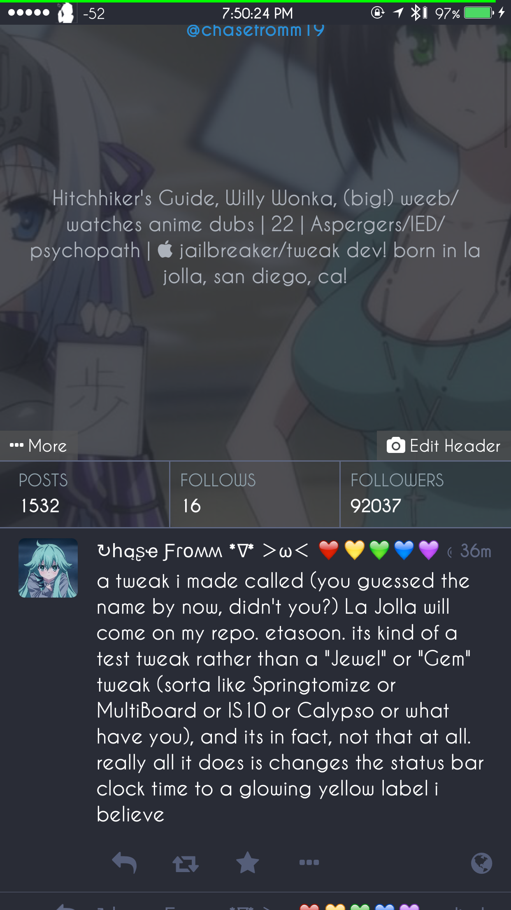

# LaJolla

Because who doesn't want to be born as a developer who just so happens to be born in, perhaps, the BEST part (La Jolla) of the BEST city (San Diego) of the BEST state (California) in the BEST country (America) in the world amirite? :P

But seriously, this tweak just adds a spoofed follower count of 92,037 followers to your Mustor app follow stats in your Mustor profile in the Mustor app for iOS.

(Also in the first screenshot, I was probably lying. Not even CLOSE to a Springtomize/MultiBoard/Calypso/IS10... whatever. This isn't even a test tweak, anyway. Although at first it was intneded to be a test...)

**NOTE**: Yes the name is sort of irrelevant to the tweak it actually does, in question.... but I still can't help but to overly obsess with my own birthtown sometimes.. but I am *sorta* promoting the city because it's just so good to travel to IMO.. Has a laid-back, beautiful environment and beautiful views with cute small shops in the village as well as fancy restaurants to eat from; and yes, the "Lorax" tree from the video (also in The Lorax by Dr. Seuss) is dead, unfortunately, according to (various, and real - *and not fake*) news sources.. :/

**NOTE 2**: I don't know why it has a Tweak.x file, and a Tweak.xm file. Those are included though for your convenience when compiling through either Theos, cygwin, or iOSOpenDev with Xcode if you're using it on the Mac.

Video on La Jolla (the real city) from Yellow Productions: https://www.youtube.com/watch?v=XSOrx0GzCzo

Screenshot: 
Screenshot 2: 
